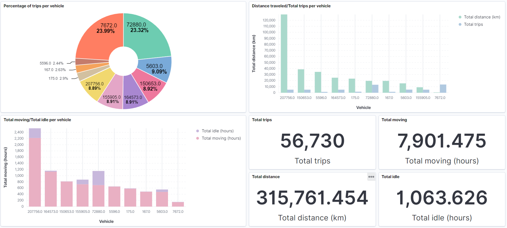

# Data Pipeline Mobi7

This repository presents a simple pipeline to get statistics per vehicle from a data source. This project has the idea of providing the user with a view of the total trips made, total kilometers traveled, total moving time and total stopped time per vehicle and per month.

 

## Requirements
* AWS Account ([sign up](https://aws.amazon.com/pt/free/?trk=eb5111a8-7144-44a0-b89b-294d1572e79e&sc_channel=ps&sc_campaign=acquisition&sc_medium=ACQ-P|PS-GO|Brand|Desktop|SU|Core-Main|Core|BR|EN|Text|PH&s_kwcid=AL!4422!3!507891927296!p!!g!!aws&ef_id=CjwKCAjw9NeXBhAMEiwAbaY4lov5VSOMQRe3mwLVOR3lq0BIXjWjNz9XPqdfNmihktN5Hu2vfoBKfhoC_4gQAvD_BwE:G:s&s_kwcid=AL!4422!3!507891927296!p!!g!!aws&all-free-tier.sort-by=item.additionalFields.SortRank&all-free-tier.sort-order=asc&awsf.Free%20Tier%20Types=*all&awsf.Free%20Tier%20Categories=*all))
* Linux System
* SED
* Make
* Docker

## Skeleton
```
├── /env
|   ├── /airflow
|   |   ├── /logs
|   |   ├── /plugins
|   ├── /app
|   |   ├── /statistic_per_vehicle
|   |   |   ├── /extractor
|   |   |   ├── /loader
|   |   |   ├── /sender
|   ├── /datasource
|   ├── /datawarehouse
|   ├── /kafka
|   |   ├── /connectors
|   |   ├── /libs
|   |   ├── /sink/config
|   |   ├── /source/config
|   ├── /kibana
|   |   ├── /pgsync
├── /imgs
├── /source
|   ├── /app
|   |   |   ├── /dags
|   |   |   ├── /etls
|   |   |   |   ├── /statistic_per_vehicle
|   |   |   |   |   ├── querys
|   |   |   ├── /services
|   |   |   |   ├── /email_sender
|   ├── /data
|   |   |   ├── /statistic_per_vehicle
```

## S3 - Folders Structure 
 

## How to Run:
The steps to set up the environment are a bit complex. ```So be careful```.

1. Create an S3 bucket called ```trip-statistics``` ([Creating a bucket](https://docs.aws.amazon.com/AmazonS3/latest/userguide/create-bucket-overview.html)) with all public acess - AWS Region: us-east-1
2. Fill your email, AWS access key and AWS secrete access key in the ```yourconfig.sh``` file (it's in the root directory of the repository)
3. Finally, with the terminal open in the root directory of the repository, run the following command:
```
$ make
```
* If you want clean your environment run:
```
$ make clean
```

Note: You can individually starts the env components using make command. But keep in mind that some components have dependencies.

With environment up you can access the Airflow to trigger the statistic per vehicle dag.

* In your browser access the portal through follwing URL:
```
localhost:8080
```

Environment information:
* URI to access the ```data warehouse``` (postgresdb):
```
localhost:3307
```

* ```Data warehouse``` login:
```
user: postgres
password: postgres
```

* Database:
```
mobi7_code_interview
```
* Table:
```
consumer_statistics
```

NOTE: Airflow grid is not showing up on the platform. The reason can see in this [Github](https://github.com/apache/airflow/discussions/23908) thread. The fix forecast is for Airflow version 2.3.2. But if you want the Airflow grid to appear, log in to the platform using the following credentials:

* Airflow login:
```
user: airflow
password: airflow
```

* Analytics dasbhoard:



NOTE: you can create your own Kibana dashboard via the following url:

```
localhost:5601
```