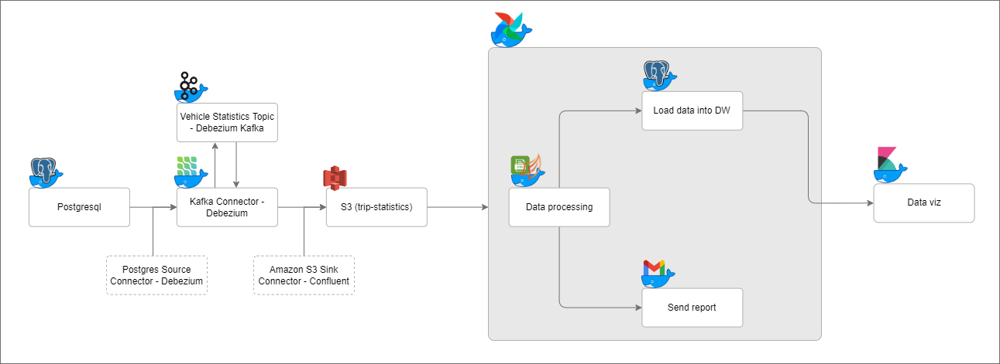

# Data Pipeline Mobi7

This repository presents a simple pipeline to get statistics per vehicle from a data source. This project has the idea of providing the user with a view of the total trips made, total kilometers traveled, total moving time and total stopped time per vehicle and per month.

 

## Requirements
* Unix System
* Make
* Docker

## Skeleton
```
├── /env
|   ├── /airflow
|   |   ├── /logs
|   |   ├── /plugins
|   ├── /app
|   |   ├── /statistic_per_vehicle
|   |   |   ├── /extractor"
|   |   |   ├── /loader
|   |   |   ├── /sender
|   ├── /datasource
|   ├── /datawarehouse
├── /source
|   ├── /app
|   |   |   ├── /dags
|   |   |   ├── /etls
|   |   |   ├── /services
|   |   |   |   ├── /email_sender
|   ├── /data
|   |   |   ├── /statistic_per_vehicle
```

## S3 - Folders Structure 
 

## How to Run:
The steps to set up the environment are a bit complex so be careful.

* In the root directory of the repository, run the following command in the terminal:
```
$ make
```
* If you want clean your environment run:
```
$ make clean
```

Note: You can individually starts the components env. Just run the make command with the following parameters: system/env, docker/source, docker/airflow or docker/datawarehouse. But keep in mind that some components have dependencies.

With environment up you can access the Airflow to trigger the statistic per vehicle dag.

* In your browser access the portal through follwing URL:
```
localhost:8080
```
* URI to access the data warehouse (postgresdb):
```
localhost:3307
```

* Data warehouse login:
```
user: postgres
password: postgres
```

* Database:
```
mobi7_code_interview
```
* Table:
```
consumer_statistics
```

NOTE: Airflow grid is not showing up on the platform. The reason can see in this [Github](https://github.com/apache/airflow/discussions/23908) thread. The fix forecast is for Airflow version 2.3.2. But if you want the Airflow grid to appear, log in to the platform using the following credentials:

* Airflow login:
```
user: airflow
password: airflow
```